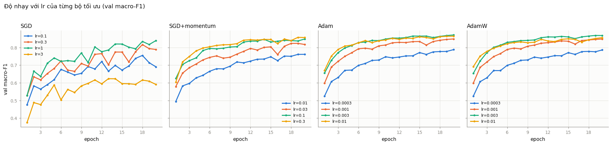
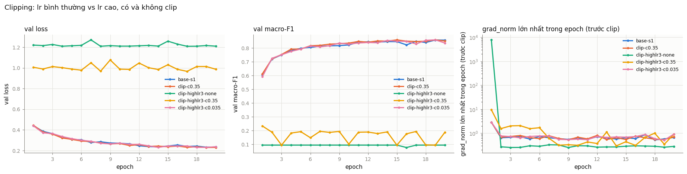
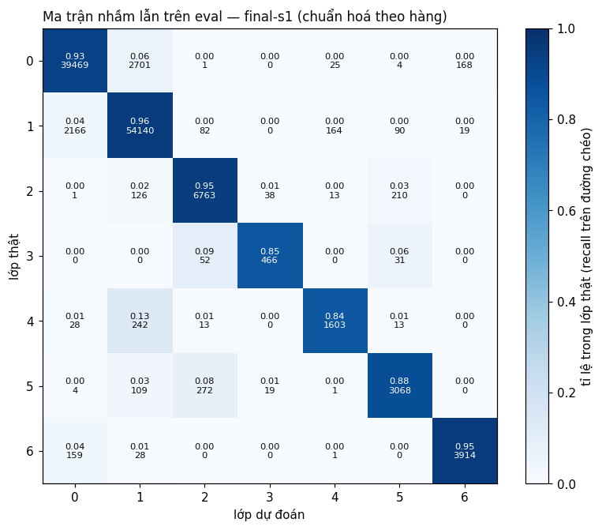

# Báo cáo Lab Day 1 — Nguyễn Cảnh Duy — 2A202602815

## 1. Thiết lập

- **Môi trường:** Google Colab, GPU Tesla T4, PyTorch 2.11.0+cu130, Python 3.13.
- **Dữ liệu:** Forest CoverType; `train` 464 809 / `eval` 116 203 theo `split_metadata.csv`. Validation: 20% của train (phân tầng, seed 42) → 371 847 train / 92 962 val. Chuẩn hoá 10 cột số bằng mean/std của phần train.
- **Model:** `M-base` (54→256→128→7, 47 879 tham số). **Baseline:** CE, SGD + momentum 0,9, lr = 0,3 (chọn bằng val trong lưới {0,01; 0,03; 0,1; 0,3}), batch 512, 20 epoch, khởi tạo He, không dropout / clip, FP32.
- **Mốc tham chiếu:** accuracy "đoán lớp đa số" trên val = 0,4876.
- **Các chủ đề đã thử:** ☑ loss ☑ optimizer ☑ hyper-parameter ☑ dropout ☑ clipping ☑ mixed precision ☑ init — 44 thí nghiệm, mỗi thí nghiệm một dòng trong `experiments.xlsx` và một ảnh `figures/<exp_id>.png`.
- Mọi lựa chọn ở mục 3 dựa trên val. Tập eval chỉ dùng ở mục 4 cho `base-s1` và `final-s1`.

## 2. Kiểm tra ban đầu và độ nhiễu

| Kiểm tra | Kết quả |
|---|---|
| Số tham số / shape logits | 47 879 / (B, 7) |
| Loss bước 0 (so với ln 7 = 1,946) | 2,2691 (He, seed 1) |
| Quá khớp 20 mẫu: loss cuối | 6,3e-5 sau 300 bước, accuracy 100% |
| Mọi tham số có gradient khác 0 | ☑ có (6/6 tham số) |
| Baseline, số seed đã chạy | 3 (`base-s1`, `base-s2`, `base-s3`) |
| Baseline: val acc (TB ± σ) | 0,9118 ± 0,0027 |
| Baseline: val macro-F1 (TB ± σ) | 0,8607 ± 0,0030 |

**Ngưỡng nhiễu dùng trong báo cáo:** 2σ = 0,0060 (val macro-F1), ước lượng từ 3 seed nên còn thô. Cột "chênh" ở mục 3 là so với trung bình baseline 0,8607; các thí nghiệm ngoài baseline và cấu hình cuối chỉ chạy 1 seed.

Loss bước 0 cao hơn ln 7 vì He áp dụng cho cả lớp ra, làm logit có độ lệch chuẩn 0,577. Khi nhân trọng số lớp ra với 0,01 thì loss = 1,9477 ≈ ln 7, nên đây không phải lỗi pipeline.

Ở baseline, train và val loss cùng giảm đến epoch 20 và khoảng cách val − train chỉ 0,026: mô hình **chưa khớp hết**, gần như không quá khớp. Điều này giải thích phần lớn kết quả bên dưới.

## 3. Kết quả theo chủ đề

### 3.1 Hàm mất mát — CE vs MSE
- **Dự đoán:** MSE kém CE rõ rệt ở cùng lr vì gradient nhỏ hơn và phạt lớp hiếm yếu hơn.
- **Kết quả** (`loss-mse`; `figures/compare_loss.png`): val macro-F1 0,7726, chênh **−0,0881** (≈ 15 lần 2σ); accuracy 0,8803 so với 0,9090. Đúng dự đoán.
- **Giải thích:** trung vị `grad_norm` của MSE là 0,065, nhỏ hơn CE (0,347) 5,3 lần, nên cùng lr thì học chậm hơn; best epoch = 20, tức chưa hội tụ. Gradient của CE theo logit là `softmax − y`, không bão hoà khi sai nặng. Macro-F1 giảm gấp ba accuracy, tức thiệt hại nằm ở lớp hiếm. Hai loss khác thang đo nên không so giá trị loss. Hạn chế: lr không dò lại cho MSE.

### 3.2 Bộ tối ưu hoá
- **Dự đoán:** Adam/AdamW nhỉnh hơn SGD+momentum khi đều được chỉnh lr; SGD thuần ở lr ×10 gần bằng SGD+momentum; Adam hỏng ở lr 1e-2; AdamW ≈ Adam.

| Bộ tối ưu | exp_id (lr tốt nhất) | lr | val macro-F1 | best epoch | chênh | vượt 2σ? |
|---|---|---|---|---|---|---|
| SGD | `opt-sgd-lr1` | 1 | 0,8344 | 18 | −0,0263 | Có (kém) |
| SGD+momentum | `opt-sgdm-lr0.3` (≡ `base-s1`) | 0,3 | 0,8573 | 19 | −0,0034 | Không |
| Adam | `opt-adam-lr0.003` | 3e-3 | **0,8677** | 19 | +0,0070 | Có (sát ngưỡng) |
| AdamW (wd 0,01) | `opt-adamw-lr0.003` | 3e-3 | 0,8646 | 18 | +0,0039 | Không |

- **Độ nhạy với lr:** biên độ macro-F1 trên lưới là 0,219 (SGD), 0,096 (SGD+momentum), 0,080 (Adam), 0,079 (AdamW). Adam ổn định nhất và không hỏng ở 1e-2 (`opt-adam-lr0.01`: 0,8639) — dự đoán sai. `opt-sgd-lr3` dao động (0,6155); `opt-sgdm-lr0.01` quá chậm (0,7613).
- **Giải thích:** Adam chia bước cho √v̂ nên độ dài bước ít phụ thuộc độ lớn gradient. SGD lr = 1 (0,8344) ≈ SGD+momentum lr = 0,1 (0,8390), đúng quy tắc lr/(1−μ). `opt-adamw-wd0-lr0.001` trùng khít Adam; wd = 0,01 chỉ gây hại ở lr = 1e-2 (−0,0147 so với Adam) vì mức suy giảm mỗi bước là lr·wd.
- Adam chỉ hơn baseline 0,0070 với một seed: bằng chứng yếu.

### 3.3 Hyper-parameter
Ảnh: `figures/compare_hparam_batch.png`, `figures/compare_hparam_model.png`.

| exp_id | yếu tố đổi | số bước | s/epoch | val macro-F1 | chênh |
|---|---|---|---|---|---|
| `hp-bs128` | batch 128 | 58 120 | 5,16 | 0,7951 | −0,0656 |
| `hp-bs2048` | batch 2048 | 3 640 | 0,33 | 0,8338 | −0,0269 |
| `hp-bs2048-lrx4` | batch 2048, lr 1,2 | 3 640 | 0,34 | 0,0936 | −0,7671 |
| `hp-wide` | 512-256 | 14 540 | 1,31 | 0,8747 | **+0,0140** |
| `hp-deep` | 256-128-64 | 14 540 | 1,47 | 0,8413 | −0,0195 |
| `hp-wd1e-4` | weight decay 1e-4 | 14 540 | 1,32 | 0,8123 | −0,0484 |
| `hp-cosine` | lịch lr cosine | 14 540 | 1,31 | 0,8947 | **+0,0340** |

Baseline: 14 540 bước, 1,29 s/epoch.

- **Batch:** tôi dự đoán batch 128 tốt hơn nhờ số bước gấp 4 — sai. lr = 0,3 được dò cho batch 512; nhiễu của bước SGD tỉ lệ lr/B, nên giảm B 4 lần là tăng nhiễu 4 lần, lại chậm gấp 4. Batch 2048 nhanh gấp 3,9 lần nhưng ít bước hơn nên kém 0,027. Tăng lr ×4 theo quy tắc tỉ lệ lô làm mô hình sụp về đoán lớp đa số: không có warmup và lr 0,3 đã sát ngưỡng ổn định.
- **Độ rộng / độ sâu:** `M-wide` giúp, phù hợp với chẩn đoán "chưa khớp". `M-deep` không giúp (dự đoán sai): val loss ngang baseline nhưng macro-F1 thấp hơn.
- **Weight decay** làm kém đi vì chính quy hoá một mô hình chưa khớp (train loss 0,2725 so với 0,2078).
- **Cosine** có lợi nhất: lr lớn lúc đầu để đi nhanh, giảm dần về 0 để hết nhấp nhô (val loss 0,1651 so với 0,2318).

### 3.4 Dropout
- **Dự đoán:** không giúp, macro-F1 giảm đơn điệu theo q, `grad_norm` tăng.
- **Kết quả** (`figures/compare_dropout.png`): `drop-0.1` 0,8385 (−0,0222), `drop-0.3` 0,7824 (−0,0783), `drop-0.5` 0,5784 (−0,2823). Khoảng cách val − train loss thu hẹp từ 0,0261 xuống 0,0022, nhưng do train loss tăng (0,2078 → 0,4227) chứ không phải val loss giảm.
- Mô hình không quá khớp nên dropout chỉ lấy bớt năng lực. Phần dự đoán về `grad_norm` sai: trung vị giảm từ 0,347 xuống khoảng 0,28; tôi chưa kiểm chứng cơ chế.

### 3.5 Gradient clipping
Ngưỡng c = 0,35 là trung vị `grad_norm` theo bước của `base-s1` (max = 2,84).

| exp_id | lr | c | val macro-F1 | tỉ lệ bước bị clip | `grad_norm` max |
|---|---|---|---|---|---|
| `clip-c0.35` | 0,3 | 0,35 | 0,8581 | 66,6% | 2,84 |
| `clip-highlr3-none` | 3 | — | 0,0936 | — | 7 810 |
| `clip-highlr3-c0.35` | 3 | 0,35 | 0,1928 | 3,3% | 9,43 |
| `clip-highlr3-c0.035` | 3 | 0,035 | 0,8549 | 100% | 2,84 |

- **lr bình thường:** clipping kích hoạt ở 2/3 số bước nhưng kết quả chỉ lệch −0,0026 (trong nhiễu), đúng dự đoán: baseline không có gai gradient gây hại.
- **lr ×10:** không clip thì không ra NaN nhưng sụp về đoán lớp đa số sau một gai `grad_norm` 7 810. Clip với c = 0,35 không cứu được (dự đoán sai): bước tối đa lr·c vẫn gấp 10 lần baseline. Clip với c = 0,035 (giữ nguyên lr·c) cứu hoàn toàn: 0,8549, trong nhiễu so với baseline. Đại lượng cần chọn là tích lr·c.

### 3.6 Mixed precision

| exp_id | s/epoch | peak_mem_MB | val macro-F1 | chênh |
|---|---|---|---|---|
| `base-s1` (FP32) | 1,29 | 173,0 | 0,8573 | −0,0034 |
| `amp-fp16` | 1,78 | 179,2 | 0,8597 | −0,0010 |
| `amp-bf16` | 1,55 | 179,4 | 0,8520 | −0,0087 |

- **Không nhanh hơn mà chậm hơn** (FP16 +38%, BF16 +20%), đúng dự đoán (`figures/compare_amp.png`). Mạng quá nhỏ nên phép nhân ma trận không phải nút thắt; autocast thêm phép chuyển kiểu, FP16 thêm `GradScaler`.
- **Độ chính xác:** FP16 ngang FP32. BF16 thấp hơn 0,0087, vừa qua 2σ với một seed: chưa đủ để kết luận.
- **GradScaler:** `amp-fp16` có 4/14 540 bước bị bỏ qua vì gradient tràn thành inf; scaler tự hạ hệ số. BF16 giữ dải số mũ của FP32 nên không cần scaler.
- **Bộ nhớ:** không giảm. `peak_mem_MB` trôi +0,18 MB sau mỗi lần chạy trong notebook, nên mức chênh 6 MB là do thứ tự chạy chứ không do AMP.

### 3.7 Khởi tạo tham số

| init (exp_id) | std sau ReLU 1 / ReLU 2 / logit | loss bước 0 | val macro-F1 | chênh |
|---|---|---|---|---|
| `init-zeros` | 0 / 0 / 0 | 1,9459 | 0,0936 | −0,7671 |
| `init-normal` | 0,0203 / 0,0022 / 0,0003 | 1,9460 | 0,8609 | +0,0002 |
| `init-xavier` | 0,163 / 0,125 / 0,192 | 2,0222 | 0,8502 | −0,0105 |
| `init-default` | 0,160 / 0,068 / 0,059 | 1,9830 | 0,8637 | +0,0029 |
| he (`base-s1`) | 0,390 / 0,366 / 0,577 | 2,2691 | 0,8573 | −0,0034 |

- **`zeros`** (đúng dự đoán): kích hoạt ẩn bằng 0 và W₃ = 0 nên không trọng số nào nhận gradient, chỉ bias lớp ra được học. Mô hình học đúng tần suất lớp: val loss 1,205, accuracy 0,4876.
- **`normal` 0,01:** kích hoạt co khoảng 10 lần mỗi lớp, epoch đầu chậm hơn (macro-F1 0,517 so với 0,604) nhưng mạng chỉ 3 lớp nên vẫn học được. `xavier` kém 0,0105 (vượt 2σ nhưng nhỏ, 1 seed).
- Mạng 3 lớp quá nông để phân biệt He và Xavier (`figures/compare_init.png`). Trên mạng 30 lớp ReLU ở bước 0, std kích hoạt lớp 30 là 0,47 (He), 8,5e-6 (Xavier), 0 (`normal`).

## 4. Đánh giá cuối trên tập eval

| Cấu hình | Seed nộp | val macro-F1 | **eval macro-F1** | eval accuracy |
|---|---|---|---|---|
| Baseline (`base-s1`) | 1 | 0,8573 | **0,8565** | 0,9089 |
| Cấu hình cuối cùng (`final-s1`) | 1 | 0,9139 | **0,9158** | 0,9417 |

- **Cấu hình cuối cùng:** Adam lr = 3e-3 (tốt nhất nhóm `optimizer`) + `M-wide` (+0,0140 > 2σ) + lịch cosine (+0,0340 > 2σ), 20 epoch, không dropout; còn lại như baseline. Quy tắc chọn được viết trước khi chạy và áp dụng trên val. Trên val, 3 seed (`final-s1..3`) cho 0,9131 ± 0,0008, tức +0,0524 so với baseline.
- **Cải thiện trên eval: +0,0593**, gấp khoảng 10 lần ngưỡng nhiễu 2σ = 0,0060 (đo trên val; eval chỉ chấm seed 1 nên không có σ trên eval).
- **Val và eval rất gần nhau:** lệch −0,0009 (baseline) và +0,0019 (final), không có dấu hiệu quá khớp vào val.

### 4.1 Phân tích lỗi theo lớp

| Lớp | support | precision | recall | F1 |
|---|---|---|---|---|
| 0 | 42 368 | 0,9436 | 0,9316 | 0,9376 |
| 1 | 56 661 | 0,9441 | 0,9555 | 0,9498 |
| 2 | 7 151 | 0,9415 | 0,9457 | 0,9436 |
| 3 | 549 | 0,8910 | 0,8488 | 0,8694 |
| 4 | 1 899 | 0,8871 | 0,8441 | 0,8651 |
| 5 | 3 473 | 0,8981 | 0,8834 | 0,8907 |
| 6 | 4 102 | 0,9544 | 0,9542 | 0,9543 |

- **Lớp khó nhất là lớp 4 (Aspen), F1 = 0,8651.** 242/1 899 mẫu (12,7%) bị đoán thành lớp 1 (Lodgepole Pine). Sát sau là lớp 3 (F1 0,8694): 52/549 mẫu bị đoán thành lớp 2.
- **Lý giải:** lớp 4 chỉ chiếm 1,6% và lớp 3 chỉ 0,5% dữ liệu; CE không trọng số bị lớp 0 và 1 (85% dữ liệu) chi phối nên recall lớp hiếm thấp hơn precision. Nhầm lẫn chia thành hai cụm gần như tách biệt, {0, 1, 4, 6} và {2, 3, 5}; tôi phỏng đoán (chưa kiểm chứng) các lớp cùng cụm chia sẻ dải độ cao và loại đất.
- So với baseline, F1 tăng nhiều nhất ở lớp hiếm (lớp 4: 0,7595 → 0,8651). **Sẽ thử:** CE có trọng số theo lớp, chọn bằng val.

## 5. Trả lời các câu hỏi dẫn dắt

1. **Bộ tối ưu nào "thắng"?** Khi mỗi bộ được chỉnh lr: Adam (0,8677) ≳ AdamW (0,8646) ≈ SGD+momentum (0,8573) > SGD (0,8344); Adam chỉ hơn SGD+momentum khoảng 0,010, sát ngưỡng nhiễu. Nếu không chỉnh lr thì kết luận phụ thuộc lr được chọn: ở cùng lr = 0,01, Adam (0,8639) hơn SGD+momentum (0,7613) tới 0,10.
2. **Dropout khi chưa quá khớp?** Không giúp: cả ba giá trị q đều làm kém đi (−0,022 đến −0,282). Nên dùng khi val loss tách khỏi train loss và tăng trở lại.
3. **Clipping giải quyết gì?** Bước cập nhật quá dài do gradient hoặc lr lớn. Ở lr = 3, không clip thì có gai `grad_norm` 7 810 rồi sụp (0,0936); clip với c = 0,035 đạt 0,8549. Ở lr bình thường nó không cải thiện gì.
4. **Mixed precision có nhanh hơn?** Không: FP16 chậm hơn 38%, BF16 chậm hơn 20% trên T4, bộ nhớ không giảm, vì mạng quá nhỏ.
5. **Vì sao zeros hỏng; He khác Xavier?** Với W = 0, không gradient nào lan về trọng số, chỉ bias lớp ra học được. He dùng Var = 2/n_vào để bù nửa phương sai bị ReLU cắt; Xavier mất dần phương sai qua mỗi lớp ReLU. Với 3 lớp gần như không khác; với 30 lớp, kích hoạt của Xavier còn 8,5e-6 trong khi He giữ 0,47.
6. **Loss không giảm sau 2 000 bước — 3 phép kiểm tra đầu tiên:**
   1. *Loss bước 0 và quá khớp 20 mẫu.* Nếu loss bước 0 xa ln C hoặc 20 mẫu không về ≈ 0 thì lỗi ở pipeline (nhãn, loss, thiếu `zero_grad`).
   2. *`grad_norm` từng tham số và độ lệch chuẩn kích hoạt theo lớp.* Gradient ≈ 0 với loss đứng ở entropy của nhãn là dấu hiệu khởi tạo hỏng hoặc mạng chết, đúng triệu chứng của `init-zeros` (trung vị `grad_norm` 0,033).
   3. *Giảm lr 10 lần và xem `grad_norm` lớn nhất.* `hp-bs2048-lrx4` và `clip-highlr3-none` có gai `grad_norm` (14,8 và 7 810) rồi đứng yên, nhìn loss thì giống hệt `init-zeros`. Phân biệt bằng lịch sử `grad_norm`: lr quá lớn có gai ở đầu, khởi tạo hỏng thì không.

## 6. Hạn chế và điều bất ngờ

- **Khác dự đoán:** batch 128 kém baseline; `M-deep` không giúp; tăng lr theo lô làm sụp mô hình; `grad_norm` giảm khi có dropout; clip với c gốc không cứu được lr cao; Adam không hỏng ở lr 1e-2; lợi ích trong cấu hình cuối đến chủ yếu từ cosine chứ không phải độ rộng, và gần như cộng dồn (0,0070 + 0,0140 + 0,0340 = 0,0550 so với 0,0524).
- **Điều có thể làm kết luận sai:**
  - Chỉ baseline và cấu hình cuối có 3 seed. Các chênh lệch sát ngưỡng (Adam +0,0070, BF16 −0,0087, Xavier −0,0105) không nên coi là kết luận.
  - lr tốt nhất của SGD+momentum (0,3) nằm ở biên trên của lưới.
  - MSE, batch, dropout, weight decay, `M-deep` đều dùng lr của baseline; một phần khác biệt là do lr không còn phù hợp.
  - So sánh batch cùng 20 epoch nhưng số bước khác nhau 16 lần.
  - `M-wide` và cosine được kiểm chứng trên SGD+momentum nhưng cấu hình cuối dùng Adam; không có phép loại bỏ từng thành phần.
- **Nếu có thêm thời gian:** 3 seed cho các kết quả sát ngưỡng; dò lr riêng cho MSE và batch 128; batch 2048 + lr ×4 có warmup; huấn luyện 40 epoch (cấu hình cuối vẫn đang cải thiện ở epoch 20); CE có trọng số theo lớp.

## 7. Phụ lục

- **File đã nộp:** `REPORT.md`; `experiments.xlsx` (44 dòng); `predictions_eval.csv`; `eval_result.json`; `code/` (`lab.ipynb` và 6 file `.py`); `figures/` (44 ảnh `<exp_id>.png`, 11 ảnh `compare_*.png`, `check_overfit20.png`, `eval_confusion_final.png`); `results/` (44 file `<exp_id>.json`); `eval_result_baseline.json` (điểm eval của `base-s1`).
- **Thời gian chạy:** tổng thời gian huấn luyện 44 thí nghiệm là 21,1 phút trên Tesla T4.
- **Ghi chú về notebook:** `code/lab.ipynb` được chạy trên Colab. Bản tải về thiếu output ở 7 ô (hyper-parameter, clipping, mixed precision, bảng init, cấu hình cuối, phân tích lỗi, ghi bảng); các ô này được chạy lại ở chế độ cache, nạp `results/<exp_id>.json` do chính lần chạy Colab ghi ra, nên log của chúng ghi `[cache]` thay vì `[train]`. Số liệu và ảnh không đổi.
